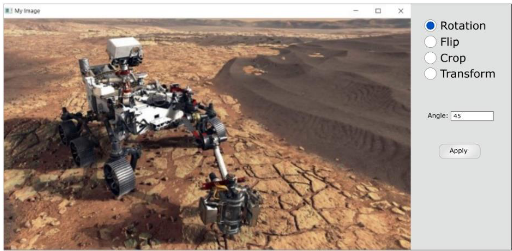

# Photo-Editor
## Objectives:
In this project students required to use image processing toolbox (OpenCV) to perform basic image manipulation processessuch as rotation, flipping, cropping, and perspectivetransformation. Students should present the features in a simple graphical user interface.

## Description:
Photo editing tasks are usually embedded to differentmobileapplications. Performing basic editing operations like rotation, flipping, and croppingis a main step before using the image. It isrequired to implement an application that can do the following tasks: 
* Import any image filefrom the disk. 
* Performthe taskschosen by the user, main tasks are:
    1. Rotation
    2. Flipping 
    3. Cropping
    4. Perspective transformation
* Additional tasks may include: 
    1. Histogram Equalization
    2. Histogram Matching 
* Preview the edited image to the user after applyingthe edit. 
* Save the edited image to the disk

## Example for the GUI Interface : 
 